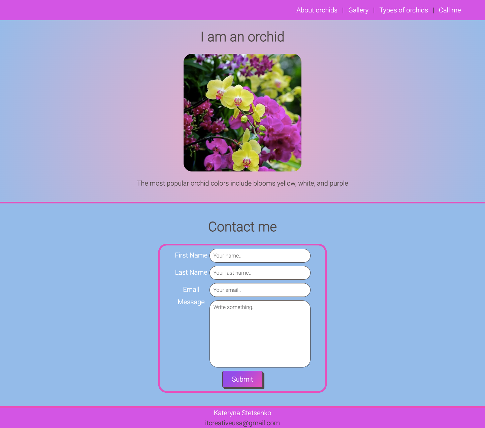

# Orchid-the-flower

## Description

Link to deployed application
 https://itcreativeusa.github.io/orchid-the-flower

Github link 
https://github.com/itcreativeusa/orchid-the-flower

This Orchid-the-flower website was created as a bootcamp everyweek student challege. This website is a HTML & CSS portfolio page. The code of this contact page was created from scratch.
Website contains: 
- Header menu
- Image with description
- Contact form
- Footer

## Table of Contents (Optional)

- [Installation](#installation)
- [Usage](#usage)
- [Requirements](#requirements)
- [Credits](#credits)
- [License](#license)

## Installation

N/A

## Requirements

No special requirements

## Usage

Screenshot located in ``` assets/images ``` folder


   

## Credits


Image of orchid was found here:

https://www.allaboutgardening.com/types-of-orchids/


## License

Please refer to the LICENSE in the repo.


